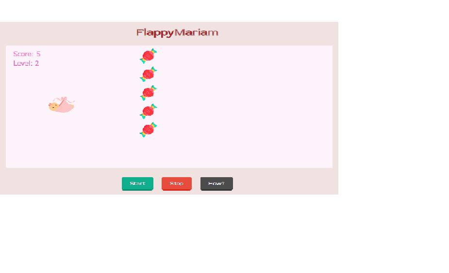
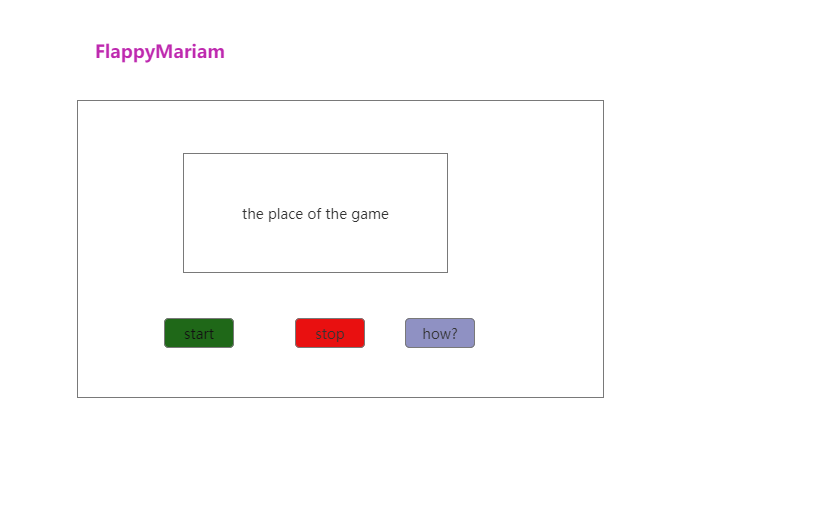

## FlappyMariam

FlappyMariam is a side-scroller where the player controls a baby, attempting to fly between candy without hitting them.

## List technologies
 * HTML
	* Tag Structure like : the `<head>` tag and the `<body>` tag
	* Links
		* the `<link>`tag defined within the  `<link>` element, inside the `<head>` section of an HTML page
	* Other tags
		* button The`<button>`tag defines a clickable button.
 * CSS
	* In `CSS` i used:

				* Background color
				* Floating
				* Positioning
				* Margins and Padding
 * JavaScript
	* I used the library `Phaser` in this project focus about the gaming and this library is a JavaScript library that makes it easier to code a game.

 ## Wireframes



- **As a user of the game, I can access and play the game at any time.**
- **As a  user of the game, I can hear the sound.**
- **As a user of the game, I can close it and play again.**
- **As a  user of the game, I can share the link with anyone.**


 ## What is this game? and I tell a story about a process and problem-solving strategy?

FlappyMariam is a side-scroller where the player controls a baby, attempting to fly between candy without hitting them. I programmed the game using the Phaser library. This library is programmed similar to how jQuery is a JavaScript library that makes it easier to modify HTML and CSS on a webpage.
The development process of this game was to create a set of functions, including creating, updating and jumping.
The problems that I encountered in programming were the introduction of sound in the game and how to connect the sound when winning and i succeeded!

 ## The problems have not been solved yet?
 It is not a real problem! It just needs to add more levels and more spead to the game in terms of difficulty.

## The winner in FlappyMariam
In this game, in every 5 level, the speed increases. When exceeding 5 score, the Level and speed increases, and when reaching score 15, the player wins.

## Demo the website

visit the website : [FlappyMariam](https://pages.git.generalassemb.ly/mariamalrashidi/Project1-FlappyMariam/)

## Some function about FlappyMariam


Use the some function like :

```
    jump: function() {  
            // when die return the start
        if (this.mariam.alive == false){
            return;
        }
        // Jump function with play jump sound and start animation
           this.mariam.body.velocity.y = -300; 
        var animation = game.add.tween(this.mariam);
        animation.to({angle: -20}, 100);
        animation.start();  
        game.sound.play('jump');
    },

```
This function talks about jumping on pressing the SPACE. Every time the child moves, depending on the SPACE.


```
    function help(){
    alert("Just click [SPACE] in your keyboard to jump, have fun");
}
```
This function helps the user how to play in case he did not know how to play it.


